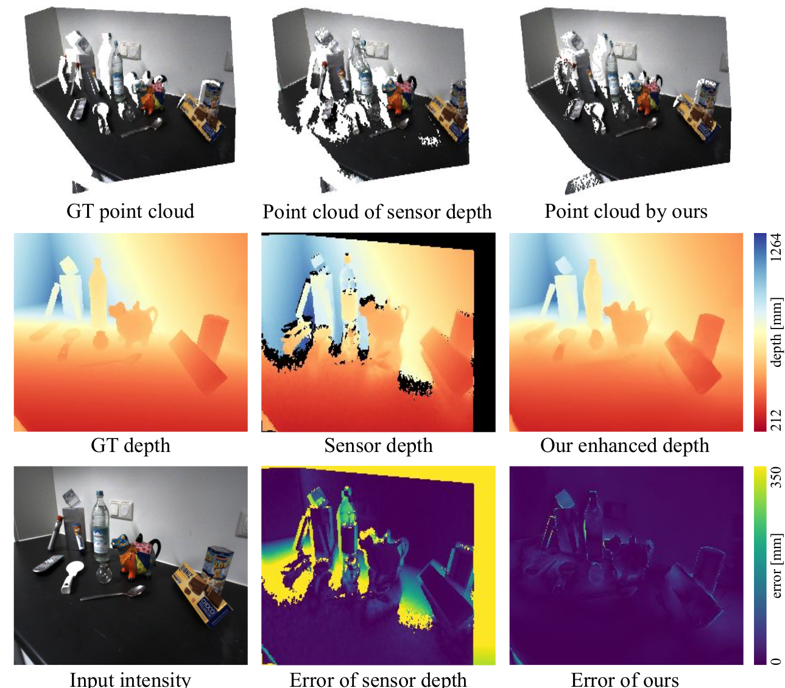

<p align="center">

  <h1 align="center">CVPR 2024 - Robust Depth Enhancement via Polarization Prompt Fusion Tuning</h1>
  <p align="center">
    <a href=""><strong>Kei Ikemura</strong></a>
    ·
    <a href="https://lastbasket.github.io/"><strong>Yiming Huang</strong></a>
    ·
    <a href="https://www.cs.princeton.edu/~fheide/"><strong>Felix Heide</strong></a>
    <br>
    <a href="https://zhaoxiangzhang.net/"><strong>Zhaoxiang Zhang</strong></a>
    ·
    <a href="https://cqf.io/"><strong>Qifeng Chen</strong></a>
    ·
    <a href="https://chenyanglei.github.io/"><strong>Chenyang Lei</strong></a>
  </p>
  <h3 align="center"> || <a href="https://arxiv.org/abs/2404.04318/">Paper</a> || <a href="https://lastbasket.github.io/PPFT/">Project Page</a> || </h3>
  <div align="center"></div>
</p> 
<p align="center">
  <a href="https://lastbasket.github.io/PPFT/">
    
  </a>
</p>
<p align="center">

## 0. Todo
- [x] Complete environment setup instruction.
- [x] Provide dataset download link and pre-processing utilities.
- [x] Provide model checkpoints and inference instruction.
- [x] Provide custom training instruction.
- [x] Provide custom evaluation instruction

### 1.1 Installation Steps
First create a conda environment:
```bash
conda create -n ppft python=3.8
conda activate ppft
```

Then install PyTorch, we have tested on the following setup:
```bash
conda install pytorch==1.10.0 torchvision==0.11.0 torchaudio==0.10.0 cudatoolkit=11.3 -c pytorch -c conda-forge
```

Install other libraries via pip:
```bash
pip install -r requirements.txt
```

Install NVIDIA Apex:
```bash
cd SELECTED_APEX_INSTALLATION_PATH
git clone https://github.com/NVIDIA/apex
cd apex
git reset --hard 4ef930c1c884fdca5f472ab2ce7cb9b505d26c1a
pip install -v --no-cache-dir --global-option="--cpp_ext" --global-option="--cuda_ext" ./
```
Install DCN:
```bash
cd model/completionformer/deformconv/ && sh make.sh
```

### 1.2 Some common issues one may encounter
if reports 
```
ImportError: cannot import name 'container_abcs' from 'torch._six'
```
then in the script where the problem occurred (i.e. _amp_state.py most likely), change 
```python
from torch._six import container_abcs
```
to
```python
import collections.abc as container_abcs
```
as mentioned in this issue: https://github.com/NVIDIA/apex/issues/1048   
   
----------------------------------------------------------------------

if reports
```
AttributeError: module 'distutils' has no attribute 'version'
```
then do
```bash
pip install setuptools==59.5.0
```
according to this issue https://github.com/pytorch/pytorch/issues/69894

## 2. Dataset
#### 2.1 Downloading HAMMER
Please run the following command to download the HAMMER dataset (in case the download link expires, please contact the original authors).   
```bash
./scripts/downloads/dataset.sh <LOCATION_OF_CHOICE>
```
By running the command, a dataset folder with path `<LOCATION_OF_CHOICE>/hammer` will be in place. Errors will be thrown if the path you indicate as in `<LOCATION_OF_CHOICE>` does not exist.

> Note: please note that the dataset zip file will not be removed after the download and the automatic unzipping, considering people may wish to keep it for other purposes (e.g. fast loading data into execution space on SLURMs). If you wish to get rid of the zip file, please perform removing manually.

#### 2.2 Processing HAMMER
We will add entries to the dataset to fascilitate more efficient training and testing. Specifically, we will process the polarization data to generate new data such as AoLP, DoLP, and etc., since reading raw data and computing them in each data loading occasion is extremely inefficient.   

Considering it is a good idea to keep the original dataset as it is in the storage device, __we will create a new folder to store everything we need to add (plus a subset of the original data we also need)__. Thus, we will NOT be using the originally downloaded dataset, but creating a new one named `<LOCATION_OF_CHOICE>/hammer_polar`.  

###### Step 1: Copy stuff
Please run the following command first, to copy data in the original dataset we need into the new data space:   

```bash
./scripts/data_processing/copy_hammer.sh <LOCATION_OF_CHOICE>/hammer
```

A new dataset at path `<LOCATION_OF_CHOICE>/hammer_polar` will be created after successful command execution.

> Note: please note that `<LOCATION_OF_CHOICE>/hammer` refers to the path to the original hammer dataset you downloaded just in the step above. In case you had the HAMMER dataset before running this project, simply replace the path to the actual path to your dataset. Also note that we assume the dataset folder contains the name "hammer" to prevent people from passing wrong dataset path accidentally.

###### Step 2: Generate new data
After copying necessary data from the original dataset to the new data space, please run the following to generate the new samples we need:  

```bash
./scripts/data_processing/process_hammer.sh <LOCATION_OF_CHOICE>/hammer_polar
```

#### 2.3 \[Optional\] Creating symbolic link to dataset
It is usually a good practice to store datasets (which are large in general) in a shared location and create symbolic links to individual project workspaces. In case you agree and wish to do this, please run the following command to create a symbolic link of the dataset in this project space quickly. Of course, you can also type the command for creating symbolic links manually, just make sure later you edit the training and testing scripts to pass a correct, alternative data root path.

```bash
./scripts/data_processing/symbolic_link_data.sh <LOCATION_OF_CHOICE>/hammer_polar
```
## 3. Model Checkpoints

#### 3.1 Foundation
We use CompletionFormer as our foundation model, thus a pre-trained checkpoint of it is required. Please run the following command to download the checkpoint. A folder named `ckpts` will be created under the project root, and the checkpoint named `NYUv2.pt` will be put beneath it.   

```bash
./scripts/downloads/foundation_ckpt.sh
```

#### 3.2 \[Optional\] Trained checkpoints
If one wishes to do testing, please download the checkpoints of the selected model type by running respective download commands as shown below:  

```bash
./scripts/downloads/model_ckpt_ppft.sh
```

The checkpoint will be downloaded under `./ckpts/ppft_final`.   

## 4. Training

Run the following to start the training process:

```bash
./scripts/runs/train.sh <MODEL>
```

Where `<MODEL>` refers to the type of model to train, which can be one of `PPFT`, `CompletionFormer`. Of course, it is welcome to add your own models as extensions.

For example, to reproduce our final model, run:

```bash
./scripts/runs/train.sh PPFT
```

> Note that you can tune the training parameters inside the training script if you wish to do so.

Experiment artifacts will be stored under `./experiments/<MODEL_NAME>_train_<YYYY-MM-DD-hh:mm:ss>`. For example, `./experiments/PPFT_train_2024-03-11-17:00:59`.

## 5. Inference & Evaluation

If reproducing our testing result is the only concern, please run:

```bash
./scripts/runs/test.sh
```

Given that the content of `test.sh` is untouched.    

To evaluate your own training outcomes, we support inference using multiple checkpoints as a convinient and flexible utility. Of course one-checkpoint inference is also available by design. 

The first step is to create a `model.txt` file that specifies your checkpoint information. Refer to `./ckpts/ppft_final/model.txt` as an example. The format of each line should be `<EPOCH> - <PATH TO CKPT>`.  


Once you have `model.txt` that is the list of checkpoints to be tested, put the path to your `model.txt` to the `CKPT_FILE` argument in `./scripts/runs/test.sh` and specify the model type in `MODEL_NAME`.

Once having done the above two steps, simply run:

```bash
./scripts/runs/test.sh
```

The experiment outcomes will be stored in `./experiments/<MODEL_NAME>_test_<YYYY-MM-DD-hh:mm:ss>`.

## 6. Acknowledgement
This work was supported by the InnoHK program.   

In addition, we thank Zhang _et al._ who kindly open-sourced their [code-base](https://github.com/youmi-zym/CompletionFormer) to the CompletionFormer model, which has been the foundation of our research as well as the code.

## 7. Cite
```
@misc{ikemura2024robust,
    title={Robust Depth Enhancement via Polarization Prompt Fusion Tuning},
    author={Kei Ikemura and Yiming Huang and Felix Heide and Zhaoxiang Zhang and Qifeng Chen and Chenyang Lei},
    year={2024},
    eprint={2404.04318},
    archivePrefix={arXiv},
    primaryClass={cs.CV}
}
```